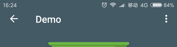

# CoordinatorTabLayout

[](https://github.com/hugeterry/CoordinatorTabLayout/blob/master/LICENSE.txt)
[ ](https://bintray.com/hugeterry/CoordinatorTabLayout/CoordinatorTabLayout/_latestVersion)

[中文版文档](README_CN.md)

CoordinatorTabLayout is a custom composite control that quickly implements the combination of TabLayout and CoordinatorLayout.
Inherited to the CoordinatorLayout, in the following components used CollapsingToolbarLayout contains TabLayout.


## Usage

### Step 1

Add the following to your build.gradle:
```groovy
dependencies {
    compile 'cn.hugeterry.coordinatortablayout:coordinatortablayout:1.1.0'
}
```

### Step 2

Config in xml:
```xml
<cn.hugeterry.coordinatortablayout.CoordinatorTabLayout xmlns:android="http://schemas.android.com/apk/res/android"
    xmlns:app="http://schemas.android.com/apk/res-auto"
    android:id="@+id/coordinatortablayout"
    android:layout_width="match_parent"
    android:layout_height="match_parent">

    <android.support.v4.view.ViewPager
        android:id="@+id/vp"
        android:layout_width="match_parent"
        android:layout_height="match_parent"
        app:layout_behavior="@string/appbar_scrolling_view_behavior" />
</cn.hugeterry.coordinatortablayout.CoordinatorTabLayout>
```


### Step 3

</br>
Use it in your own code:</br>
1.`setTitle(String title)`:Set the CoordinatorTabLayout's title.</br>
2.`setupWithViewPager(ViewPager viewPager)`:To link the two together.</br>
3.`setImageArray(int[] imageArray)`:Set the image array of the header according to the number of tabs and pass it to the control.</br>
```java
        //Add the fragment to the viewpager
        initFragments();
        initViewPager();
        //Image array
        mImageArray = new int[]{
                R.mipmap.bg_android,
                R.mipmap.bg_ios,
                R.mipmap.bg_js,
                R.mipmap.bg_other};

        mCoordinatorTabLayout = (CoordinatorTabLayout) findViewById(R.id.coordinatortablayout);
        mCoordinatorTabLayout.setTitle("Demo")
                .setImageArray(mImageArray)
                .setupWithViewPager(mViewPager);
```

Finish, enjoy it.


## More

### Set the content scrim


`setImageArray(int[] imageArray, int[] colorArray)`:Set the color array to use for the content scrim for each tab.
```java
        mColorArray = new int[]{
                android.R.color.holo_blue_light,
                android.R.color.holo_red_light,
                android.R.color.holo_orange_light,
                android.R.color.holo_green_light};
        mCoordinatorTabLayout.setImageArray(mImageArray, mColorArray);
 ```

### Set translucent status bar



`setTransulcentStatusBar(Activity activity)`:Set translucent status bar,Support android4.4 and above.
```java
mCoordinatorTabLayout.setTransulcentStatusBar(activity);
```

### Set back enable
`setBackEnable(Boolean canBack)`:To enable the Up button for an activity that has a parent activity.
```java
    @Override
    protected void onCreate(Bundle savedInstanceState) {
        ...
        mCoordinatorTabLayout.setBackEnable(true);
        ...
    }
    @Override
    public boolean onOptionsItemSelected(MenuItem item) {
        if (item.getItemId() == android.R.id.home) {
            finish();
        }
        return super.onOptionsItemSelected(item);
    }
```

### Load header images from network

`setLoadHeaderImagesListener(LoadHeaderImagesListener loadHeaderImagesListener)`:Set the listener that gets the header images.
```java
    @Override
    protected void onCreate(Bundle savedInstanceState) {
        ...
        mCoordinatorTabLayout.setTitle("Demo")
                .setBackEnable(true)
                .setContentScrimColorArray(mColorArray)
                .setLoadHeaderImagesListener(new LoadHeaderImagesListener() {
                    @Override
                    public void loadHeaderImages(ImageView imageView, TabLayout.Tab tab) {
                        switch (tab.getPosition()) {
                            case 0:
                                //load header images
                                break;
                            ...
                        }
                    }
                })
                .setupWithViewPager(mViewPager);
    }
```
You also can load header images using glide/picasso，[Sample](https://github.com/hugeterry/CoordinatorTabLayout/blob/master/sample/src/main/java/cn/hugeterry/coordinatortablayoutdemo/LoadHeaderImageFromNetworkActivity.java)

### Gets the child control
`getActionBar()`:get the ActionBar<br/>
`getTabLayout()`:get the TabLayout<br/>
`getImageView()`:get the ImageView

[More code](https://github.com/hugeterry/CoordinatorTabLayout/blob/master/sample/src/main/java/cn/hugeterry/coordinatortablayoutdemo/MainActivity.java)


## Attributes
- `app:contentScrim` -> color.Defaults to ?attr/colorPrimary
- `app:tabIndicatorColor` -> color.
- `app:tabTextColor` -> color.

## Demo
[http://fir.im/ctlayout](http://fir.im/ctlayout)

## LICENSE
    Copyright 2017 HugeTerry.
    Licensed under the Apache License, Version 2.0 (the "License");
    you may not use this file except in compliance with the License.
    You may obtain a copy of the License at

       http://www.apache.org/licenses/LICENSE-2.0

    Unless required by applicable law or agreed to in writing, software
    distributed under the License is distributed on an "AS IS" BASIS,
    WITHOUT WARRANTIES OR CONDITIONS OF ANY KIND, either express or implied.
    See the License for the specific language governing permissions and
    limitations under the License.

